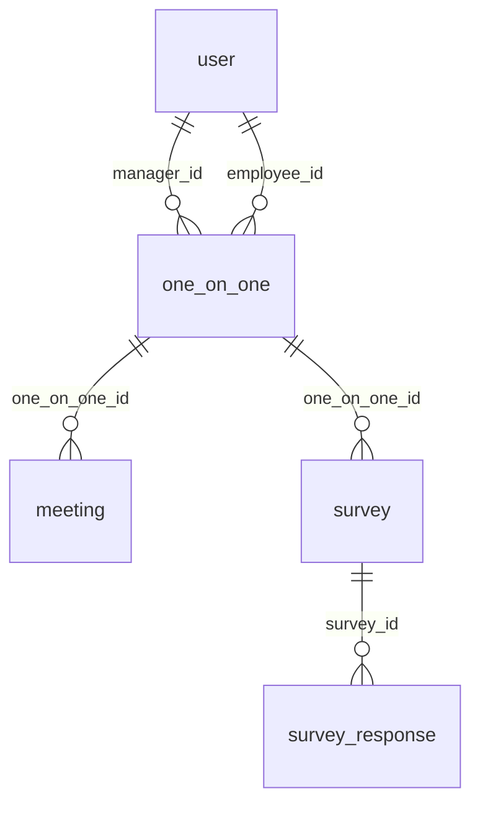
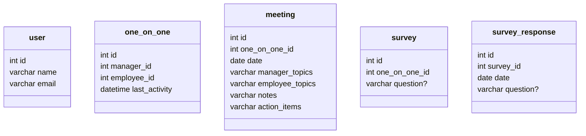

# One-on-one

This is an application that enables storing details about manager/employee one-on-ones.

## Features

- Allows manager and employee access
- Supports pre-planned topics from manager and employee, in meeting notes, and follow-up items
- Supports surveys to track question responses on an ongoing basis

## Structure

Entity Relationship Diagram:

Table Diagram:

